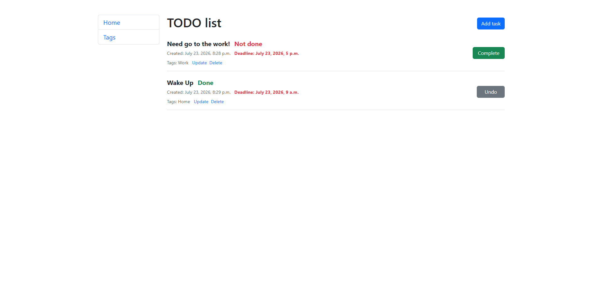
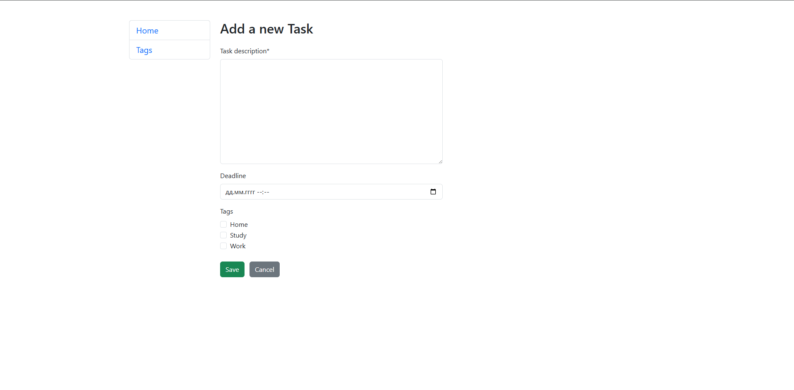
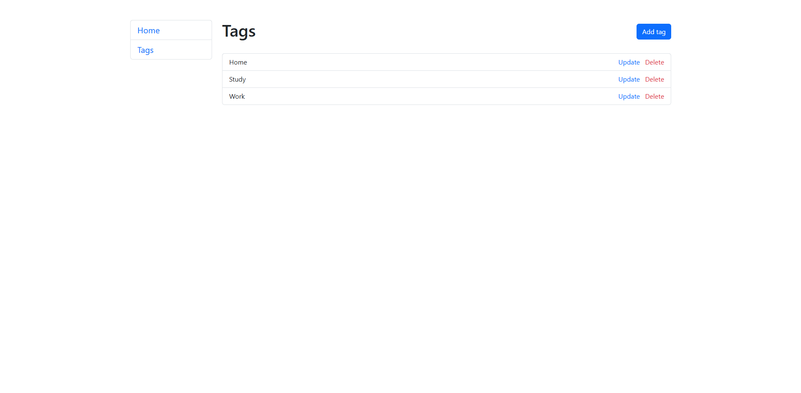

# Todo List App 📝

A simple and user-friendly web application for task management, built with Python and the Django framework.

## 🌟 Features

*   **Task Management:** Create, read, update, and delete tasks (CRUD).
*   **Tag Management:** Create, read, update, and delete tags to categorize tasks.
*   **Many-to-Many Relationship:** Attach multiple tags to a single task.
*   **Task Status:** Mark tasks as `Complete` or `Undo` them.
*   **Smart Sorting:** Uncompleted tasks are always at the top, and completed ones go to the bottom (sorted from newest to oldest).
*   **Responsive Design:** The interface is styled using Bootstrap 5.
*   **User-friendly Forms:** Uses `django-crispy-forms` for beautiful input fields, including checkboxes for tag selection.

## 📸 Screenshots

**Home Page (Task List)**


**Add / Update Task Form**


**Tag List**


## 🛠 Technologies

*   **Backend:** Python 3, Django
*   **Database:** SQLite3 (default)
*   **Frontend:** HTML, CSS, Bootstrap 5 (CDN)
*   **Additional Libraries:** `django-crispy-forms`, `crispy-bootstrap5`

## 🚀 How to run the project locally

Follow these steps to deploy the project on your machine:

### 1. Clone the repository
```bash
git clone [https://github.com/YourUsername/my_todo_list.git](https://github.com/YourUsername/my_todo_list.git)
cd my_todo_list
```

### 2. Create and activate a virtual environment

For Windows:
```bash
python -m venv venv
venv\Scripts\activate
```

for Mac
```bash
python3 -m venv venv
source venv/bin/activate
```

### 3. Install dependencies
```bash
pip install -r requirements.txt
```

### 4. Apply database migrations
```bash
python manage.py migrate
```

### 5. Run the development server
```bash
python manage.py runserver
```

### After that, open your browser and go to: http://127.0.0.1:8000/